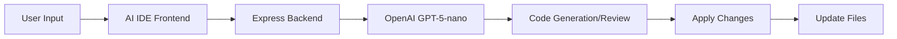

<div align="center">

# 🚀 AI IDE

### Local AI-Powered Coding Environment

[](https://react.dev)
[](https://nodejs.org)
[](https://openai.com)

*An intelligent IDE that writes, debugs, and explains code for you*

</div>

---

## ✨ Features

| Feature | Description |
|---------|-------------|
| 🔍 **Code Review** | AI-powered code analysis with best practices suggestions |
| 🏗️ **Project Generation** | Create complete projects from natural language |
| 🧠 **Codebase Understanding** | AI reads your entire project automatically |
| 🐛 **Smart Debugging** | Explain errors and propose fixes instantly |
| ✏️ **AI Code Editing** | Modify code with natural language instructions |
| 📝 **Memory System** | Tracks all changes in `history.md` |

---

## 🛠️ Tech Stack

<table>
<tr>
<td align="center"><b>Frontend</b></td>
<td align="center"><b>Backend</b></td>
<td align="center"><b>AI</b></td>
</tr>
<tr>
<td>
• React 19<br>
• Vite<br>
• Monaco Editor<br>
• React Router
</td>
<td>
• Node.js<br>
• Express<br>
• File System API
</td>
<td>
• OpenAI GPT-5-nano<br>
• Ollama (optional)
</td>
</tr>
</table>

---

## 🚀 Quick Start

### Prerequisites
- Node.js 18+
- OpenAI API Key

### Installation

```bash
# Clone the repository
git clone https://github.com/Nishant-aiml/TechmentorX.git
cd TechmentorX

# Setup Backend
cd BackEnd
npm install
cp .env.example .env  # Add your OPENAI_API_KEY
npm start

# Setup Frontend (new terminal)
cd Frontend
npm install
npm run dev
```

### Access the App
| Page | URL |
|------|-----|
| Code Review | http://localhost:5173/ |
| AI IDE | http://localhost:5173/ide |

---

## ⚙️ Configuration

Create `BackEnd/.env`:

```env
OPENAI_API_KEY=your_api_key_here
OPENAI_MODEL=gpt-5-nano
AI_PROVIDER=openai
```

---

## 📁 Project Structure

```
TechmentorX/
├── 📂 BackEnd/
│   ├── 📂 src/
│   │   ├── 📂 services/
│   │   │   ├── ai.service.js         # Code review AI
│   │   │   ├── ide-ai.service.js     # IDE AI assistant
│   │   │   ├── workspace.service.js  # File operations
│   │   │   └── memory.service.js     # History tracking
│   │   └── 📂 routes/
│   │       ├── ai.routes.js          # /ai endpoints
│   │       └── ide.routes.js         # /ide endpoints
│   └── server.js
│
└── 📂 Frontend/
    └── 📂 src/
        ├── 📂 pages/
        │   ├── CodeReviewPage.jsx
        │   └── IDEPage.jsx
        └── 📂 components/ide/
            ├── WorkspaceSelector.jsx
            ├── FileTree.jsx
            ├── CodeEditor.jsx
            └── AIChat.jsx
```

---

## 🎯 How It Works



1. **Open Workspace** → Select any local folder
2. **Ask AI** → Describe what you want in natural language
3. **Review Changes** → Preview diff before applying
4. **Apply** → AI writes the code to your files

---

## 📸 Screenshots

| Workspace Selector | AI IDE Interface |
|-------------------|------------------|
| Open folders or create new projects | 3-panel layout with file tree, editor, and AI chat |

---

## 🤝 Contributing

Contributions are welcome! Please feel free to submit a Pull Request.

---

## 📄 License

MIT License - feel free to use this project for any purpose.

---

<div align="center">

**Built with ❤️ using AI**

</div>
